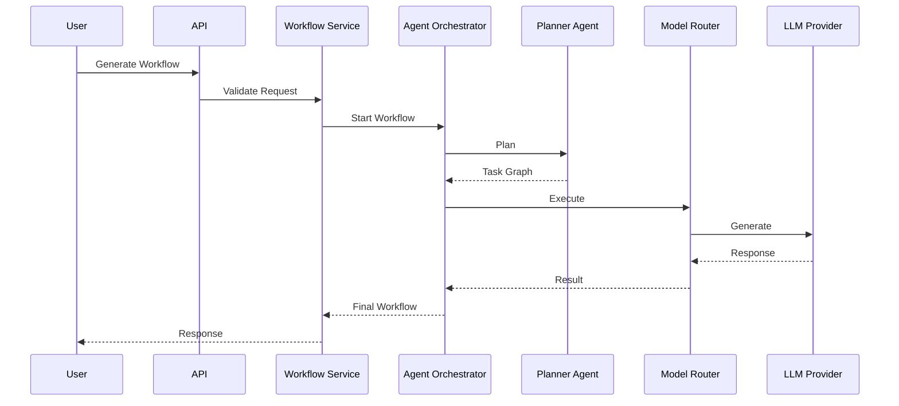

# TWIB Architecture

> **Version:** 1.0
>
> **Project:** TWIB (Total Workflow Intelligence Builder)
>
> **Document Type:** Enterprise Software Architecture
>
> **Status:** Approved
>
> **Last Updated:** August 2026

---

# Table of Contents

1. Introduction
2. Vision
3. Architectural Philosophy
4. Design Goals
5. System Overview
6. High-Level Enterprise Architecture
7. AI-Native Architecture
8. Clean Architecture
9. Architectural Principles
10. Layer Responsibilities

---

# 1. Introduction

TWIB (Total Workflow Intelligence Builder) is an enterprise-grade AI platform designed to generate, analyze, optimize, validate, and execute intelligent business workflows using multiple AI agents.

Unlike traditional workflow automation systems, TWIB is **AI-native**. Artificial Intelligence is not treated as an additional feature—it is the core execution engine of the platform.

The platform enables organizations to describe business problems in natural language while multiple specialized AI agents collaborate to produce optimized workflow pipelines that can later be reviewed, modified, executed, and monitored.

The architecture described in this document defines the long-term technical direction of the project and serves as the authoritative reference for every contributor, developer, AI coding assistant, and future maintainer.

---

# 2. Vision

## Mission

Create an enterprise platform capable of transforming human intent into executable business workflows through collaborative AI agents.

## Vision Statement

> "Enable organizations to build intelligent workflow systems without writing workflow logic manually."

TWIB should become an operating system for AI-driven business process generation.

---

# 3. Architectural Philosophy

TWIB follows several fundamental engineering philosophies.

## AI First

Artificial Intelligence is the center of the system.

Every business workflow is generated, analyzed, validated, optimized, and documented through collaborative AI agents.

---

## Enterprise Before Prototype

Every module should be production-ready.

The project should avoid:

- temporary shortcuts
- tightly coupled modules
- hardcoded configurations
- prototype architecture

---

## Replaceable Components

Every major component should be replaceable.

Examples include:

- Database
- Cache
- Authentication Provider
- LLM Provider
- Vector Database
- Storage
- Payment Provider

Changing implementations should never require rewriting business logic.

---

## Loose Coupling

Modules communicate only through interfaces.

No module should directly depend on implementation details.

---

## High Cohesion

Each component should have one clearly defined responsibility.

---

## Scalability by Design

The architecture should support:

- multiple organizations
- multiple AI providers
- multiple workflow engines
- distributed execution
- horizontal scaling

without redesign.

---

# 4. Design Goals

The architecture must satisfy the following goals.

| Goal | Description |
|-------|-------------|
| Scalability | Horizontal scaling of every major subsystem |
| Reliability | Graceful failure and automatic recovery |
| Maintainability | Modular architecture with clear boundaries |
| Extensibility | Easy addition of providers, tools, and plugins |
| Security | Enterprise-grade authentication and authorization |
| Observability | Comprehensive logging, metrics, tracing |
| Testability | Every layer independently testable |
| Performance | Efficient execution and intelligent caching |
| AI Flexibility | Model-independent architecture |
| Developer Experience | Clear documentation and predictable structure |

---

# 5. System Overview

TWIB consists of four major subsystems.

## 1. User Platform

Responsible for:

- authentication
- dashboard
- workflow editor
- project management
- collaboration

---

## 2. AI Platform

Responsible for:

- planning
- reasoning
- validation
- optimization
- documentation
- orchestration

---

## 3. Workflow Platform

Responsible for:

- graph execution
- scheduling
- checkpoints
- retries
- persistence

---

## 4. Infrastructure Platform

Responsible for:

- databases
- cache
- storage
- monitoring
- deployment
- networking

---

# 6. High-Level Enterprise Architecture

```text
                     ┌──────────────────────────────┐
                     │        PRESENTATION          │
                     │ Next.js • Dashboard • Admin │
                     └──────────────┬──────────────┘
                                    │
                                    ▼
                     ┌──────────────────────────────┐
                     │          API LAYER          │
                     │ FastAPI • REST • WebSocket  │
                     └──────────────┬──────────────┘
                                    │
                                    ▼
                     ┌──────────────────────────────┐
                     │    APPLICATION SERVICES      │
                     │ Users • Workflows • Billing  │
                     └──────────────┬──────────────┘
                                    │
                                    ▼
                     ┌──────────────────────────────┐
                     │     AGENT ORCHESTRATOR       │
                     │ Coordinates Every AI Agent   │
                     └──────────────┬──────────────┘
                                    │
                                    ▼
                     ┌──────────────────────────────┐
                     │      WORKFLOW ENGINE         │
                     │ Graph • Executor • Retry     │
                     └──────────────┬──────────────┘
                                    │
                                    ▼
                     ┌──────────────────────────────┐
                     │   CONTEXT & MEMORY LAYER     │
                     │ Context • Memory • Prompts   │
                     └──────────────┬──────────────┘
                                    │
                                    ▼
                     ┌──────────────────────────────┐
                     │       MODEL ROUTER           │
                     │ Provider Selection & Routing │
                     └──────────────┬──────────────┘
                                    │
                                    ▼
                     ┌──────────────────────────────┐
                     │        DOMAIN LAYER          │
                     │ Business Rules & Entities    │
                     └──────────────┬──────────────┘
                                    │
                                    ▼
                     ┌──────────────────────────────┐
                     │      REPOSITORY LAYER        │
                     │ Repository Interfaces        │
                     └──────────────┬──────────────┘
                                    │
                                    ▼
                     ┌──────────────────────────────┐
                     │    INFRASTRUCTURE LAYER      │
                     │ PostgreSQL • Redis • Qdrant  │
                     └──────────────────────────────┘
```

---

# 7. AI-Native Architecture

Unlike conventional SaaS systems, TWIB introduces dedicated AI infrastructure.

The AI subsystem consists of six independent layers.

```
Application Service

↓

Agent Orchestrator

↓

Workflow Engine

↓

Context Manager

↓

Model Router

↓

LLM Providers
```

Each layer has a single responsibility and communicates through interfaces.

This allows:

- provider replacement
- independent testing
- horizontal scaling
- future agent expansion

without architectural changes.

---

# 8. Clean Architecture

TWIB adopts Clean Architecture to enforce dependency direction and long-term maintainability.

## Dependency Rule

All dependencies point inward.

Outer layers may depend on inner layers.

Inner layers never depend on outer layers.

```
Presentation

↓

API

↓

Application Services

↓

Domain

↓

Repository Interfaces

↓

Infrastructure Implementations
```

The Domain layer remains completely independent of frameworks, databases, or third-party services.

---

# 9. Architectural Principles

## Single Responsibility Principle

Each module has one reason to change.

Examples:

- AuthenticationService handles authentication.
- WorkflowService handles workflow operations.
- PlannerAgent performs planning only.

---

## Open/Closed Principle

The system should be open for extension but closed for modification.

Examples:

- Add a new LLM provider without modifying existing services.
- Add a payment provider through a new adapter.
- Add a plugin without changing core modules.

---

## Dependency Inversion

Business logic depends on abstractions rather than implementations.

Every infrastructure component implements an interface defined by the application or domain layer.

---

## Interface Segregation

Interfaces remain small and focused.

Example:

- UserRepository
- WorkflowRepository
- LLMProvider
- CacheProvider

instead of one large interface.

---

## Composition Over Inheritance

Prefer composition unless inheritance clearly improves clarity.

---

## Convention Over Configuration

Predictable folder structure and naming conventions reduce unnecessary configuration.

---

# 10. Layer Responsibilities

## Presentation Layer

### Responsibilities

- Render user interface
- Handle user interactions
- Maintain client-side state
- Display workflow graphs
- Stream AI responses

### Must Never

- Access databases
- Call LLM providers directly
- Implement business logic

---

## API Layer

### Responsibilities

- Request validation
- Authentication
- Authorization
- Serialization
- WebSocket communication

### Must Never

- Execute workflow logic
- Query databases directly
- Build prompts

---

## Application Service Layer

This layer contains all application use cases.

Examples:

- Create Workflow
- Generate Workflow
- Execute Workflow
- Create Organization
- Invite Members
- Manage Billing

It orchestrates business operations but delegates AI reasoning to the Agent Orchestrator.

---

# 11. AI Core Architecture

Traditional SaaS applications place business logic at the center of the system.

TWIB is fundamentally different.

Artificial Intelligence is not an auxiliary feature—it is the execution engine responsible for planning, reasoning, validating, optimizing, documenting, and orchestrating business workflows.

To support this, TWIB introduces a dedicated AI architecture that remains completely independent from presentation, API, and infrastructure concerns.

The AI subsystem is composed of several specialized layers.

```
Application Service
        │
        ▼
Agent Orchestrator
        │
        ▼
Workflow Engine
        │
        ▼
Context Manager
        │
        ▼
Memory Layer
        │
        ▼
Model Router
        │
        ▼
Tool Registry
        │
        ▼
LLM Providers
```

Each layer owns one responsibility and communicates only through interfaces.

This ensures:

- Loose coupling
- Independent testing
- Provider replacement
- Horizontal scalability
- Long-term maintainability

---

# 12. Agent Orchestration Layer

The Agent Orchestrator coordinates every AI agent participating in workflow generation.

It acts as the central intelligence coordinator rather than performing reasoning itself.

Its primary responsibility is deciding:

- which agent executes
- execution order
- parallel execution
- dependency resolution
- conflict resolution
- retry policies
- human approval routing

The orchestrator never communicates directly with databases or external APIs.

Instead, it delegates work to specialized agents.

---

## Responsibilities

- Execute workflow generation pipeline
- Schedule AI agents
- Merge outputs
- Detect failures
- Retry failed tasks
- Trigger checkpoints
- Coordinate human approvals
- Publish workflow events

---

## Never Responsible For

- Prompt engineering
- Database access
- Memory storage
- Authentication
- Business validation
- API handling

---

## Agent Coordination

```
                 Supervisor Agent
                         │
 ┌──────────────┬────────┼───────────┬──────────────┐
 ▼              ▼                    ▼              ▼
Planner     Analyst           Architect      Researcher
 │              │                    │              │
 └──────────────┴──────────┬─────────┴──────────────┘
                           ▼
                     Validator Agent
                           │
                           ▼
                    Optimizer Agent
                           │
                           ▼
                 Documentation Agent
```

The Supervisor Agent never performs business reasoning itself.

Instead, it coordinates execution.

---

# 13. AI Agent Architecture

Every AI agent follows the same contract.

```python
class BaseAgent:

    async def execute(
        self,
        context: AgentContext
    ) -> AgentResult:
        ...
```

Every implementation must satisfy this interface.

---

## Standard Agent Lifecycle

```
Receive Task

↓

Validate Input

↓

Load Context

↓

Retrieve Memory

↓

Call Required Tools

↓

Build Prompt

↓

Execute Model

↓

Validate Output

↓

Return Result
```

Each agent remains stateless.

All state resides inside the Context Manager and Workflow Engine.

---

## Built-in Agents

### Planner Agent

Responsible for

- understanding objectives
- decomposing problems
- planning execution

Produces

- execution plans
- task graphs

---

### Analyst Agent

Responsible for

- requirement extraction
- ambiguity detection
- dependency discovery

Produces

- requirement specification

---

### Architect Agent

Responsible for

- workflow structure
- component relationships
- system design

Produces

- workflow blueprint

---

### Research Agent

Responsible for

- external knowledge
- documentation lookup
- semantic retrieval

Produces

- research summaries
- supporting evidence

---

### Validator Agent

Responsible for

- correctness
- consistency
- policy enforcement

Produces

- validation reports

---

### Optimizer Agent

Responsible for

- simplification
- cost reduction
- execution optimization

Produces

- optimized workflows

---

### Documentation Agent

Responsible for

- documentation generation
- explanations
- workflow descriptions

Produces

- markdown
- diagrams
- documentation

---

### Supervisor Agent

Responsible for

- orchestration
- scheduling
- dependency resolution

Never generates workflow content.

---

# 14. Workflow Engine

The Workflow Engine executes workflow graphs generated by AI agents.

It is conceptually similar to modern workflow orchestration systems while remaining independent of any specific implementation.

---

## Responsibilities

- Graph execution
- Node scheduling
- Parallel execution
- Dependency resolution
- Retry policies
- Checkpointing
- Resume execution
- Timeout handling

---

## Workflow Graph

```
Start

↓

Planner

↓

Analyst

↓

Architect

↓

Validator

↓

Optimizer

↓

Documentation

↓

End
```

Future versions may execute independent nodes in parallel whenever dependencies allow.

---

## Execution States

Every workflow moves through the following lifecycle.

```
Created

↓

Queued

↓

Running

↓

Waiting

↓

Retrying

↓

Completed

↓

Archived
```

Failure transitions

```
Running

↓

Failed

↓

Retry

↓

Completed

or

Cancelled
```

---

# 15. Workflow State Machine

Each workflow maintains a durable state.

```
Draft

↓

Planning

↓

Analysis

↓

Architecture

↓

Validation

↓

Optimization

↓

Documentation

↓

Ready

↓

Executing

↓

Completed
```

A workflow may return to previous states after validation failures.

This allows iterative refinement instead of complete regeneration.

---

# 16. Context Management Layer

Large Language Models possess limited context windows.

TWIB introduces a dedicated Context Manager responsible for constructing optimal prompts.

The Context Manager owns:

- conversation history
- prompt construction
- token budgeting
- memory retrieval
- summarization
- context compression

No AI agent communicates directly with memory providers.

---

## Responsibilities

- Build prompts
- Merge retrieved memory
- Compress conversations
- Remove redundant history
- Track token usage
- Prepare model input

---

## Context Flow

```
Conversation

↓

Context Manager

↓

Memory Retrieval

↓

Prompt Builder

↓

Token Optimizer

↓

Model Router
```

---

# 17. Memory Architecture

TWIB separates memory into multiple independent systems.

Each solves a different problem.

```
                 Memory Layer
                      │
     ┌────────────────┼────────────────┐
     ▼                ▼                ▼
Short-term      Long-term       Semantic Memory
     │                │                │
     └────────────────┼────────────────┘
                      ▼
              Workflow Memory
```

---

## Short-Term Memory

Stores

- current conversation
- active workflow
- temporary agent outputs

Typically backed by Redis.

---

## Long-Term Memory

Stores

- organization preferences
- user preferences
- historical decisions

Persisted in PostgreSQL.

---

## Semantic Memory

Stores

- embeddings
- documentation
- uploaded knowledge

Implemented using Qdrant.

---

## Workflow Memory

Stores

- previously generated workflows
- reusable templates
- execution history

Allows future workflow reuse.

---

# 18. Prompt Lifecycle

Every prompt follows a deterministic lifecycle.

```
User Request

↓

Context Retrieval

↓

Memory Retrieval

↓

Prompt Assembly

↓

Token Optimization

↓

Model Execution

↓

Validation

↓

Response
```

This pipeline ensures consistent prompt generation regardless of provider.

---

# 19. Model Router

TWIB supports multiple LLM providers simultaneously.

The Model Router determines which model should execute each request.

The router is provider-agnostic.

Application Services never reference individual models.

---

## Responsibilities

- Provider selection
- Cost optimization
- Latency optimization
- Capability matching
- Streaming
- Retry
- Failover

---

## Routing Example

Reasoning

↓

Nemotron

Coding

↓

Qwen

Fast Generation

↓

DeepSeek

Summarization

↓

Gemma

---

If one provider becomes unavailable, the router transparently selects another compatible provider without affecting higher layers.

---

# 20. LLM Provider Layer

Every provider implements the same interface.

```python
class LLMProvider(Protocol):

    async def generate(...):

        ...

    async def stream(...):

        ...
```

Supported providers include:

- Ollama
- OpenAI-compatible APIs
- DeepSeek
- Qwen
- Nemotron
- Gemma
- Mistral
- Future providers

No application code should depend on provider-specific SDKs.

All integrations occur through provider adapters.

---

# 21. Tool Registry

Artificial Intelligence should never directly communicate with external systems.

Instead, every external capability is exposed through a standardized Tool Registry.

This creates a clean separation between reasoning and execution.

```
AI Agent

↓

Tool Registry

↓

Tool Interface

↓

Concrete Tool

↓

External System
```

Examples of external systems include:

- GitHub
- Jira
- Slack
- Notion
- Google Drive
- Gmail
- PostgreSQL
- Redis
- File System
- AWS S3
- Azure Storage

---

## Why a Tool Registry?

Without a Tool Registry every AI model would require direct integration with every external service.

This creates:

- tight coupling
- duplicate code
- inconsistent permissions
- difficult testing

Instead, agents request capabilities from the Tool Registry.

The registry determines:

- whether the tool exists
- whether the user has permission
- how the tool executes
- how results are returned

---

## Standard Tool Interface

Every tool implements the same interface.

```python
class Tool(Protocol):

    name: str

    description: str

    async def execute(
        self,
        parameters: dict
    ) -> ToolResult:
        ...
```

This allows any future tool to integrate into TWIB without modifying existing code.

---

## Tool Categories

### Communication

- Email
- Slack
- Teams
- Discord

---

### Development

- GitHub
- GitLab
- Bitbucket

---

### Project Management

- Jira
- Trello
- Asana
- ClickUp

---

### Storage

- Local Storage
- S3
- Azure Blob
- Google Cloud Storage

---

### AI

- Embeddings
- Image Generation
- Speech
- OCR

---

### Enterprise

- ERP
- CRM
- HRMS
- Accounting

---

# 22. Plugin Architecture

The Tool Registry is extended through Plugins.

A plugin is a collection of one or more tools.

```
Plugin

↓

Tools

↓

Capabilities

↓

Agent
```

Examples

GitHub Plugin

```
GitHub

├── Create Issue

├── Clone Repository

├── Search Code

└── Commit Changes
```

Slack Plugin

```
Slack

├── Send Message

├── Read Channel

├── Upload File

└── Create Channel
```

Future contributors should never modify the core system when adding integrations.

They simply register new plugins.

---

## Plugin Lifecycle

```
Install

↓

Register

↓

Validate

↓

Load

↓

Available

↓

Execute

↓

Unload
```

---

# 23. Domain Layer

The Domain Layer represents the core business knowledge of TWIB.

It contains no framework dependencies.

It has no database knowledge.

It has no HTTP knowledge.

It has no AI provider knowledge.

It defines only enterprise business rules.

---

## Domain Components

```
Entities

↓

Value Objects

↓

Aggregates

↓

Policies

↓

Events

↓

Specifications
```

---

### Entities

Examples

- User
- Organization
- Workflow
- Project
- Agent
- Workspace

---

### Value Objects

Examples

- Email
- Password Hash
- Workflow Status
- Agent ID
- Organization ID

---

### Domain Services

Domain Services represent business operations that do not naturally belong to one entity.

Examples

- Workflow Validation
- Permission Evaluation
- Billing Calculation

---

### Domain Events

Examples

```
WorkflowCreated

WorkflowCompleted

AgentFinished

UserInvited

OrganizationCreated

PaymentReceived
```

The Domain Layer never sends emails.

Never updates analytics.

Never creates notifications.

It only publishes events.

---

# 24. Repository Layer

Repositories abstract all persistence.

Application Services never access databases directly.

```
Application Service

↓

Repository Interface

↓

Repository Implementation

↓

Database
```

---

## Responsibilities

Repositories

- save entities

- retrieve entities

- update entities

- delete entities

- query collections

They never contain business rules.

---

## Repository Pattern

```
WorkflowRepository

↓

SQLWorkflowRepository

↓

PostgreSQL
```

Future implementations may include

- MongoDB

- DynamoDB

without changing services.

---

# 25. Infrastructure Layer

The Infrastructure Layer contains every external dependency.

Examples

```
Database

Redis

Qdrant

Ollama

Stripe

SMTP

AWS

Azure

Logging

Monitoring

Storage
```

Every infrastructure component implements an interface defined by an inner layer.

---

## Responsibilities

Infrastructure handles

- persistence

- caching

- networking

- payments

- storage

- authentication adapters

- monitoring

- messaging

Nothing more.

---

# 26. Event Bus Architecture

TWIB follows an Event-Driven Architecture.

Business events are published once.

Multiple systems react independently.

```
Workflow Created

↓

Event Bus

↓

Analytics

↓

Notification

↓

Audit Log

↓

Email

↓

Realtime Updates

↓

Metrics

↓

Webhook
```

This keeps modules loosely coupled.

---

## Event Types

Business Events

Examples

```
WorkflowGenerated

WorkflowExecuted

WorkflowFailed
```

---

System Events

Examples

```
CacheMiss

DatabaseConnected

ProviderUnavailable

RedisDisconnected
```

---

Security Events

Examples

```
UserLogin

PermissionDenied

PasswordChanged

TokenExpired
```

---

# 27. Background Processing

Long-running operations should never block HTTP requests.

Instead they execute asynchronously.

```
API Request

↓

Queue

↓

Worker

↓

Execution

↓

Persistence
```

Examples

- Workflow generation
- Embedding creation
- Email delivery
- AI summarization
- Large imports
- File indexing

---

## Worker Responsibilities

Workers execute

- scheduled workflows

- retries

- notifications

- cleanup

- vector indexing

- AI execution

---

# 28. Human Approval Pipeline

Enterprise workflows often require human review.

TWIB supports approval checkpoints.

```
Planner

↓

Architect

↓

Validator

↓

Human Review

↓

Approved?

↓

YES

↓

Continue

↓

NO

↓

Return For Revision
```

Approval rules are configurable per organization.

---

# 29. Workflow Versioning

Every workflow is immutable after publication.

Instead of overwriting,

TWIB creates versions.

```
Workflow

│

├── v1

├── v2

├── v3

└── v4
```

Each version stores

- graph

- prompts

- execution history

- documentation

- metadata

This enables rollback and comparison.

---

# 30. Enterprise AI Pipeline

The complete AI execution pipeline is shown below.

```
User Request

↓

Application Service

↓

Agent Orchestrator

↓

Workflow Engine

↓

Context Manager

↓

Memory Retrieval

↓

Prompt Builder

↓

Model Router

↓

LLM Provider

↓

Tool Calls

↓

Validation

↓

Checkpoint

↓

Persistence

↓

Event Bus

↓

Realtime Updates

↓

User Response
```

Every component has a single responsibility.

Every component can evolve independently.

Every component is replaceable.

This architecture ensures TWIB remains scalable, maintainable, and adaptable as AI models, workflow engines, and enterprise integrations evolve.

---

# 31. Identity & Access Management (IAM)

Identity and Access Management (IAM) is responsible for verifying user identity and controlling access to platform resources.

TWIB separates authentication from authorization.

Authentication answers:

> Who is the user?

Authorization answers:

> What is the user allowed to do?

These responsibilities must never be mixed.

---

## Authentication Architecture

```
User

↓

Login Request

↓

Identity Provider

↓

Authentication Service

↓

JWT + Refresh Token

↓

API Gateway

↓

Protected Resources
```

Authentication providers are interchangeable.

Supported providers include:

- Email & Password
- Google OAuth
- GitHub OAuth
- Microsoft Azure AD
- Enterprise SSO (Future)
- SAML 2.0 (Future)

---

## Authentication Responsibilities

Authentication Service is responsible for:

- User Login
- Registration
- Password Reset
- Email Verification
- Token Generation
- Token Refresh
- Logout
- MFA (Future)

It must never contain business logic.

---

# 32. Authorization Architecture

TWIB follows Role-Based Access Control (RBAC).

Future enterprise versions may additionally support Attribute-Based Access Control (ABAC).

---

## Authorization Flow

```
Incoming Request

↓

JWT Validation

↓

Permission Resolver

↓

Role Evaluation

↓

Resource Validation

↓

Access Granted / Denied
```

---

## Built-in Roles

Platform Roles

- Super Administrator
- Platform Administrator
- Support Engineer

Organization Roles

- Owner
- Administrator
- Manager
- Developer
- Analyst
- Viewer

Project Roles

- Maintainer
- Contributor
- Observer

Future versions may allow custom roles.

---

## Permission Model

Permissions are resource-based.

Example:

```
workflow:create

workflow:update

workflow:delete

workflow:execute

workflow:share

workflow:approve

agent:execute

organization:manage

billing:view
```

Authorization evaluates permissions instead of hardcoded roles.

---

# 33. Multi-Tenant Architecture

TWIB is designed as a multi-tenant SaaS platform.

Each organization is completely isolated.

```
Platform

├── Organization A

│       ├── Workspace

│       ├── Users

│       └── Projects

├── Organization B

│       ├── Workspace

│       ├── Users

│       └── Projects

└── Organization C
```

No organization may access another organization's data.

---

## Tenant Hierarchy

```
Platform

↓

Organization

↓

Workspace

↓

Project

↓

Workflow

↓

Execution
```

Every resource belongs to exactly one organization.

---

# 34. Workspace Architecture

A Workspace represents a collaborative environment.

It contains:

- Members
- Projects
- Workflows
- Knowledge Base
- AI Configurations
- Billing Configuration

Future enterprise editions may support multiple workspaces per organization.

---

# 35. Security Architecture

Security is integrated into every layer.

TWIB follows Defense in Depth.

```
Internet

↓

Cloudflare

↓

Web Application Firewall

↓

Reverse Proxy

↓

Rate Limiter

↓

Authentication

↓

Authorization

↓

Application

↓

Database
```

Every request passes multiple security checkpoints.

---

## Security Principles

- Zero Trust
- Least Privilege
- Secure by Default
- Encryption Everywhere
- Audit Everything

---

## Encryption

Data in Transit

TLS 1.3

Data at Rest

AES-256

Passwords

Argon2id

Secrets

Vault

JWT

Signed and verified

---

# 36. Secrets Management

Secrets must never exist inside source code.

Allowed storage:

- Environment Variables (Development)

- Hashicorp Vault

- AWS Secrets Manager

- Azure Key Vault

Future deployment environments determine the secret provider.

---

# 37. API Gateway

Every request enters through a centralized API Gateway.

Responsibilities

```
Authentication

↓

Authorization

↓

Rate Limiting

↓

Validation

↓

Logging

↓

Routing
```

The gateway should remain stateless.

---

# 38. Rate Limiting

Rate limiting protects both infrastructure and AI resources.

Different limits may exist for

- anonymous users

- authenticated users

- premium organizations

- enterprise customers

AI endpoints have stricter limits due to inference costs.

---

## Example

```
Authentication

20 requests/minute

Workflow Generation

5 requests/minute

Workflow Execution

30 requests/minute

Read APIs

300 requests/minute
```

Limits are configurable.

---

# 39. Caching Strategy

Caching improves latency while reducing infrastructure cost.

TWIB follows a multi-layer cache architecture.

```
Application

↓

L1 Cache

↓

Redis

↓

Database
```

---

## Cache Types

Session Cache

Stores

- user sessions
- refresh tokens

Workflow Cache

Stores

- generated workflows

Prompt Cache

Stores

- repeated prompts

Embedding Cache

Stores

- embedding vectors

Permission Cache

Stores

- resolved permissions

---

## Cache Strategy

Cache Aside

```
Application

↓

Cache

↓

Database
```

Frequently accessed objects remain cached.

---

# 40. Database Architecture

TWIB follows a relational-first architecture.

```
Application

↓

Repositories

↓

SQLAlchemy

↓

PostgreSQL
```

---

## Primary Entities

Platform

↓

Organization

↓

Workspace

↓

Project

↓

Workflow

↓

Workflow Version

↓

Execution

↓

Conversation

↓

Messages

↓

Billing

↓

Audit Logs

---

## Database Principles

- ACID Transactions
- Optimistic Locking
- Foreign Keys
- Soft Deletes
- Audit Columns
- UUID Primary Keys

---

# 41. Vector Database Architecture

Semantic search is isolated from relational storage.

```
Knowledge

↓

Embedding Model

↓

Vector Database

↓

Similarity Search

↓

Retrieved Context
```

Primary vector database

Qdrant

Future alternatives

- Pinecone

- Weaviate

- Chroma

---

# 42. Retrieval-Augmented Generation (RAG)

TWIB uses Retrieval-Augmented Generation to provide organization-specific intelligence.

```
User Request

↓

Embedding

↓

Similarity Search

↓

Knowledge Retrieval

↓

Context Assembly

↓

Prompt

↓

LLM
```

Knowledge sources include:

- PDFs
- DOCX
- Markdown
- Internal Documentation
- Previous Workflows
- Organization Knowledge Base

---

# 43. Audit Logging

Every important action must be auditable.

Examples

- Login

- Logout

- Workflow Creation

- Workflow Execution

- Role Changes

- Permission Changes

- Billing Changes

Audit logs are immutable.

---

# 44. Data Governance

TWIB treats customer data as organization-owned.

Policies

- Tenant Isolation
- Data Retention
- Right to Delete
- Data Export
- Backup Strategy
- Disaster Recovery

Enterprise deployments may define custom retention periods.

---

# 45. Enterprise Compliance

Future enterprise deployments should support:

- GDPR

- SOC 2

- ISO 27001

- HIPAA (optional)

- PCI DSS (payments)

Compliance should influence implementation without changing the architecture.

---

# 46. Production Infrastructure Architecture

TWIB is designed as a cloud-native application.

Every service must be independently deployable, scalable, observable, and resilient.

The platform follows a container-first architecture using Docker during development and Kubernetes in production.

```
Developer

↓

Git Repository

↓

CI Pipeline

↓

Docker Image

↓

Container Registry

↓

Kubernetes Cluster

↓

Production
```

Every deployment must be reproducible.

---

# 47. Container Architecture

Every major component executes inside its own container.

```
                    Docker Compose

 ┌──────────────────────────────────────────────┐
 │                                              │
 │  Frontend (Next.js)                          │
 │                                              │
 │  Backend API (FastAPI)                       │
 │                                              │
 │  PostgreSQL                                 │
 │                                              │
 │  Redis                                      │
 │                                              │
 │  Qdrant                                     │
 │                                              │
 │  Ollama / LLM Runtime                        │
 │                                              │
 │  Worker Service                              │
 │                                              │
 │  Nginx Reverse Proxy                          │
 │                                              │
 └──────────────────────────────────────────────┘
```

Containers communicate only through internal networks.

No service should depend on localhost.

---

# 48. Kubernetes Architecture

Production deployments use Kubernetes.

```
                    Internet
                        │
                        ▼
                Cloudflare / CDN
                        │
                        ▼
                 Load Balancer
                        │
                        ▼
                  Kubernetes
                        │
        ┌───────────────┼───────────────┐
        ▼               ▼               ▼
 API Pods         Worker Pods      AI Pods
        │               │               │
        └───────────────┼───────────────┘
                        ▼
                  Redis Cluster
                        │
                        ▼
                  PostgreSQL
                        │
                        ▼
                    Qdrant
```

Each component scales independently.

---

# 49. Service Architecture

Every service owns a single responsibility.

```
Frontend Service

↓

API Service

↓

Worker Service

↓

Inference Service

↓

Monitoring Service
```

Services communicate through HTTP, WebSockets, queues, or events.

No service accesses another service's database directly.

---

# 50. CI/CD Pipeline

Every change follows the same automated delivery pipeline.

```
Developer

↓

Git Push

↓

GitHub Actions

↓

Lint

↓

Unit Tests

↓

Integration Tests

↓

Security Scan

↓

Docker Build

↓

Push Container

↓

Deploy Staging

↓

Smoke Tests

↓

Deploy Production
```

No manual deployment should be required.

---

# 51. Deployment Strategy

TWIB follows progressive deployment.

```
Development

↓

Testing

↓

Staging

↓

Production
```

Production deployments should support:

- Rolling Updates
- Blue/Green Deployments
- Canary Releases
- Rollback

Deployment must be zero-downtime whenever possible.

---

# 52. Background Worker Architecture

Long-running operations execute in dedicated worker services.

Examples include:

- Workflow generation
- Embedding generation
- RAG indexing
- Scheduled workflows
- Notifications
- Email delivery
- Report generation

```
API

↓

Queue

↓

Worker

↓

Execution

↓

Database
```

Workers should be horizontally scalable.

---

# 53. Logging Architecture

Logging is a first-class system component.

Every request receives a Correlation ID.

```
Request

↓

Middleware

↓

Logger

↓

JSON Logs

↓

Log Aggregation

↓

Dashboard
```

Every log should contain:

- Timestamp
- Correlation ID
- User ID (if authenticated)
- Organization ID
- Log Level
- Service Name
- Execution Time

Sensitive information must never be logged.

---

# 54. Metrics Architecture

TWIB exposes operational and business metrics.

Operational Metrics

- Request Rate
- Error Rate
- Latency
- CPU
- Memory
- Queue Length

Business Metrics

- Workflows Generated
- Workflows Executed
- Active Organizations
- AI Tokens Consumed
- Cost per Workflow

Metrics are exported using Prometheus.

Visualization is provided through Grafana.

---

# 55. Distributed Tracing

Distributed tracing enables debugging across services.

OpenTelemetry is used for instrumentation.

```
Frontend

↓

API

↓

Workflow Service

↓

Agent

↓

Model Router

↓

LLM Provider

↓

Response
```

Each step becomes a trace span.

---

# 56. AI Cost Monitoring

AI inference is expensive.

Every model invocation should be tracked.

Metrics include:

- Prompt Tokens
- Completion Tokens
- Response Time
- Cost Estimate
- Provider
- Model
- Organization
- User

This enables:

- Billing
- Analytics
- Cost Optimization

---

# 57. Failure Recovery Strategy

Failures are expected.

Every subsystem must degrade gracefully.

Recovery mechanisms include:

- Retry Policies
- Circuit Breakers
- Provider Failover
- Checkpoints
- Queue Recovery
- Automatic Restart

The system should recover automatically whenever possible.

---

# 58. Retry Strategy

Retries should use exponential backoff.

```
Attempt 1

↓

1 second

↓

Attempt 2

↓

2 seconds

↓

Attempt 3

↓

4 seconds

↓

Attempt 4

↓

8 seconds
```

Maximum retry counts are configurable.

---

# 59. Circuit Breaker Pattern

External providers may become unavailable.

The circuit breaker prevents repeated failures.

```
Healthy

↓

Failure Threshold Reached

↓

Open Circuit

↓

Cooldown

↓

Half Open

↓

Healthy
```

This protects both the application and external providers.

---

# 60. Model Failover Strategy

The Model Router supports transparent failover.

```
Primary Model

↓

Failure

↓

Compatible Provider

↓

Continue Execution
```

Example

```
Nemotron

↓

Unavailable

↓

DeepSeek

↓

Continue
```

Failover should preserve execution context whenever possible.

---

# 61. Horizontal Scaling

TWIB scales individual subsystems independently.

Examples

```
API Pods

3 → 20

Worker Pods

2 → 100

Embedding Workers

2 → 50

Inference Workers

1 → 40
```

Scaling decisions are based on CPU, memory, queue length, and request volume.

---

# 62. High Availability

Critical services should avoid single points of failure.

Recommended redundancy:

- Multiple API replicas
- Redis Sentinel or Cluster
- PostgreSQL Primary + Read Replica
- Multiple AI workers
- Load-balanced ingress

---

# 63. Backup & Disaster Recovery

The platform should support:

- Automated database backups
- Point-in-time recovery
- Object storage versioning
- Infrastructure as Code
- Disaster recovery testing

Recovery procedures should be documented and tested regularly.

---

# 64. Observability

Observability combines:

```
Logs

+

Metrics

+

Traces

+

Events
```

Together they provide complete visibility into the platform.

Observability is considered a core architectural concern rather than an optional feature.

---

# 65. Future Evolution Strategy

TWIB is designed for continuous evolution.

Future capabilities may include:

- Multi-Agent Collaboration Marketplace
- Visual Workflow Builder
- Voice-driven Workflow Generation
- Federated Agent Networks
- Autonomous Workflow Optimization
- AI Governance Policies
- Prompt Version Control
- Agent Marketplace
- Enterprise Plugin Marketplace
- Cross-Organization Knowledge Sharing (opt-in)
- Edge AI Execution

These features should integrate through existing interfaces without requiring architectural redesign.

---

# 66. Architectural Decision Records (ADR)

Major technical decisions are documented separately.

Example structure:

```
docs/

adr/

0001-clean-architecture.md

0002-fastapi.md

0003-postgresql.md

0004-model-router.md

0005-agent-orchestrator.md

0006-qdrant.md

0007-workflow-engine.md

0008-backend-package-layout.md

0009-authentication-hybrid.md
```

Each ADR records:

- Context
- Decision
- Alternatives Considered
- Consequences

This ensures future contributors understand why architectural choices were made.

---

# 67. Conclusion

TWIB is designed as an AI-native, enterprise-grade workflow intelligence platform.

The architecture emphasizes:

- Clean separation of concerns
- AI-first design
- Extensibility
- Scalability
- Security
- Observability
- Maintainability

Every subsystem communicates through well-defined interfaces, allowing independent evolution without compromising the overall architecture.

This document serves as the authoritative architectural specification for the TWIB platform. All implementation phases, code generation, and future enhancements must align with the principles and structures defined here.

---
Appendix A — Sequence Diagrams

• User Login
• Workflow Generation
• AI Agent Communication
• Tool Calling
• Model Failover
• RAG Retrieval
• Workflow Execution
• Human Approval
• Plugin Execution


**End of Architecture Document**